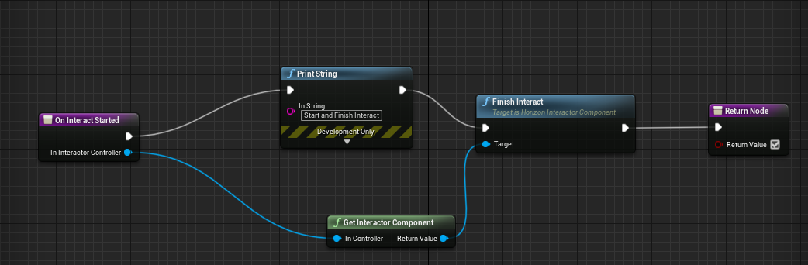

[Marketplace](https://www.unrealengine.com/marketplace/en-US/product/horizon-interact-plugin) 

[](https://dev.azure.com/hsgame/UE4HorizonPlugin/_build/latest?definitionId=51&repoName=HorizonInteractDemo&branchName=main)

public feed: nuget.org  

[](https://www.nuget.org/packages/HorizonInteractDemo/)
  

Note: 

main branch may be unstable since it is in development, please switch to tags, for example: editor/4.27.0.1

How to Run Demo Project before purchase:(Only for Win64 editor build, no source code)
1. Double click install_game_package_from_nuget_org.cmd, and check if UE4Editor-*.dll are installed to Binaries\Win64 and Plugins\HorizonInteractDemo\Binaries\Win64\
2. Double click HorizonInteractDemo.uproject  

  
----------------------------------------------
              HorizonInteract
                 5.1.0
         http://dorgon.horizon-studio.net
          	dorgonman@hotmail.com
----------------------------------------------
   
-----------------------
System Requirements
-----------------------

Supported UnrealEngine version: 4.26-5.1
 

-----------------------
Installation Guide
-----------------------

If you want to use plugins in C++, you should add associated module to your project's 
YOUR_PROJECT.Build.cs:
PublicDependencyModuleNames.AddRange(new string[] { "HorizonInteract"});

-----------------------
User Guide: Quick Start
-----------------------

1. Create Blueprint class that inherited from HorizonInteractObject_SphereTrigger and setup HintWidgetComponent.

    

2. Add HorizonInteractorComponent into Default Pawn Classe.  

  

3. Setup Collision and Collision Profile for Interactor and InteractObject.


Interactor             |  InteractObject
:-------------------------:|:-------------------------:
 |  
 |   


4. InputAction Setup: Project Setting

Open Project Setting and Add InputAction Interact


5. InputAction Setup: Call Input Action in Controller Pawn.


6. InteractObject: Override OnInteractStarted


You should call FinishInteract when your interaction finished:



  

-----------------------
User Guide: Selector
-----------------------

In HorizonInteractorComponent, we can design selector class using Blueprint for determine which InteractObject we want to interact base on game design. It will detect which registered InteractObject we are currently interacting and notify OnInteractObjectChangedEvent callbacks when InteractObject changed. Register/Unregister Logic are managed by OnBeginOverlapTrigger/OnEndOverlapTrigger in InteractObjectComponent.


Currently this plugin implement following Selector:

1. HorizonInteractObjectSelector: It simply return first Regeisted InteractObject. 

2. PreferNearest: It will try to sort and pick nearest InteractObject base on the distance to Interactor Object.

3. PreferNearestWithSameDirection: Same as PreferNearest with additional rule to prefer select InteractObject with same direction of Interactor.

4. PreferNearestOnlySameDirection: Same as PreferNearest with additional rule to only select InteractObject with same direction of Interactor.

5. UnderCursor: Select InteractObject under player's cursor. You can check /Game/_HorizonInteractDemo/Blueprint/InteractObject/Selector/BP_InteractObjectSelector_UnderCursor to see how to customize UnderCursor Logic using Blueprint.
 
 
  

-----------------------
User Guide: Initialize TriggerComponent and HintWidget
-----------------------

You should call InteractObjectComponent->Init(InteractObjectTriggerComponent, HintWidgetComponent) and setup callbacks in the BeginPlay of InteractObject/InteractCharacter. If your InteractHint is displaying on Player's HUD and don't want to display it  with each InteractObject using WidgetComponent, you may want to pass nullptr to HintWidgetComponent and set up HintWidget Display Logic in OnInteractHintWidgetVisibilityEvent callback.

Currently this plugin implement Following InteractObject/InteractCharacter that implement default Init and Callbacks behavior for convenience:

  ```
  AHorizonInteractCharacter_SphereTrigger  
  AHorizonInteractCharacter_BoxTrigger
  AHorizonInteractCharacter_CapsuleTrigger
  AHorizonInteractObject_SphereTrigger
  AHorizonInteractObject_BoxTrigger
  AHorizonInteractObject_CapsuleTrigger 
  ```

Usually you will want to initialize and setup callbacks using your own Actor or Character instead of inherited from thoses Actors.

-----------------------
User Guide: HintWidget
-----------------------

HorizonInteractorComponent will notify Visibility changes to previous and current HintWidget. We can setup our own HintWidget Display logic using OnInteractHintWidgetVisibilityEvent callback, ex: Run Show/Hide Widget Animation, Set Mesh Outline. Following ScreenShot demostrate how to customize Interact Hint when we inherited from AHorizonInteractCharacter:


 


Note: ReturnNode should return true to override default behavior(It simply Show/Hide WidgetComponent) of AHorizonInteractObject/AHorizonInteractCharacter.


-----------------------
User Guide: Listen/Dedicated Server support
-----------------------

This plugin is designed to use with network game in mind, but it didn't worked out of box, since it is very difficult to handle all use case without knowing project design. 

This plugin support network that rely havily on Reliable RPC. When Client call Interactor's InteractPressed/InteractReleased, it will send RPC to Server. By default bUseNetworkLocalPredition is enabled, which means client will call those function locally so it can minimize client delay cause by Replicated Variable from Server. 

This plugin didn't handle any replication, which means you will need to enable replicate in those Actors/Component that the state may be modified in InteractSystem's callbacks.


  
 

You may also want to implment Variable replication RepNotify logics in your project in order to ensure Client's and Server's State is same.  

 

-----------------------
Technical Details
-----------------------

Features:

1. AHorizonInteractCharacter and AHorizonInteractObject support SphereTrigger, BoxTrigger and CapsuleTrigger for interaction.
  
2. Flexible callbacks for customization: OnInteractStarted, OnInteractTickStarted, OnInteractTick, OnInteractFinished, OnInteractAborted and OnInteractHintWidgetVisibility.

3. UHorizonInteractorComponent support InteractPressed and InteractReleased Server RPC with network prediction.

4. InteractObject support InteractStartDelay, ex: hold down the button for 2 seconds to open the door.

5. Use UHorizonInteractObjectSelector to select which InteractObject that Interactor want to interact, current selector implemented in plugin: PreferNearest, PreferNearestWithSameDirection, PreferNearestOnlySameDirection and UnderCursor.

Code Modules:

 HorizonInteract (Runtime)


Network Replicated: False  

Supported Development Platforms: Win64, Mac, Linux  

Supported Target Build Platforms: All Platforms  

Tested Platform: Win64  

Documentation: https://github.com/dorgonman/HorizonInteractDemo  

Example Project: https://github.com/dorgonman/HorizonInteractDemo  

The goal of this plugin is to provide a general Interact System that can be custotmized for different gameplay. You can interact with character or object using different method, for example, limit the player can only interact with the object that player face or under the mouse cursor.


[DemoVideo](https://youtu.be/wdclGx1IIwQ)  
[TutorialVideo](https://www.youtube.com/watch?v=l-WCsGpg_fo&feature=youtu.be)

-----------------------
What does your plugin do/What is the intent of your plugin
-----------------------  

The goal of this plugin is to provide a general Interact System that can be custotmized for different gameplay.

-----------------------
Contact and Support
-----------------------

email: dorgonman@hotmail.com  

-----------------------
 Version History
-----------------------

*5.1.0  

    Update to 5.1.0 and some minor refactor

*5.0.0  

* AB#2414 [New] StartInteract/FinishInteract with server RPC

* AB#2339 [BugFix][Selector] PreferNearestOnlySameDirection should sort before pick


*4.27.0  

* AB#2098 [New][HorizonInteractObjectComponent] Implement GetInteractors

* AB#2098 [New][HorizonInteractObjectComponent] Add GetInteractors

* AB#2058 [New][HorizonInteractDelegates] Fix Behavior of FHorizonInteractDelegates::OnInteractHintWidgetVisibilityEventNative

* AB#2058 [New][HorizonInteractDelegates] Implement all Interactor and InteractObjectComponent callbacks

* AB#1935 [New][InteractorComponent] More callbacks: OnInteractObjectStartedEvent, OnInteractObjectFinishedEvent, OnInteractObjectAbortedEvent

* [Performance] Implement DECLARE_HORIZONINTERACT_QUICK_SCOPE_CYCLE_COUNTER

* AB#2230 [BugFix] Blueprint CustomInteractObject can't FinishInteract second times

* [New][Build] PublicDefinitions.Add("WITH_HORIZONINTERACT=1");

* [Refactor][HorizonInteractorComponent] SelectorClass = UHorizonInteractObjectSelector_PreferNearest

* [New][HorizonInteractorComponent] Implement IsInteractStarted

* Refactor HORIZONINTERACT_STRINGIZE


*4.26.0  

        NEW: First Version including core features.  